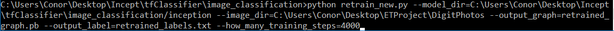

# Emerging technologies Project
Name: Conor Tighe
GMIT ID: G00314417
Application: Image-Identifier
Lecturer: Ian McLoughlin

This is the solution for the Emerging technology [project](https://emerging-technologies.github.io/problems/project.html), It can recongnize digits + 1000 other classes.

# Overview:
*This application accepts and image from the user, displays it to the user then attempts to predict what the image is once submitted to a Inception-v3 model. You can upload a digit or draw your own digit inside the application and the retrained Inception-v3 model for digits will predict what digit was in the image based on the MNIST dataset . You can also upload any image to a seperate model that will try classfiy the image into 5 of 1000 possible classes used for Inception-v3 with tensorflow.*

## Architecture

-Flask: *Flask is a micro web framework written in Python and based on the Werkzeug toolkit and Jinja2 template engine. This is what I used to host the application and server the html pages to the user*

-FabricJs: *Fabric.js is a powerful and simple. Javascript HTML5 canvas library. Fabric provides interactive object model on top of canvas element. I use this to implement a canvas the user can draw digits on along with being easily saved locally.*

-Tensorflow: *TensorFlow is an open-source software library for dataflow programming across a range of tasks. This is what I use to implement the Inception-v3 model for predicting the images. Once model is retrained for digit images and another is trained for 1000 classes.*

-AJAX: *AJAX allows web pages to be updated asynchronously by exchanging data with a web server behind the scenes. This means that it is possible to update parts of a web page, without reloading the whole page. This is what
I use to implment the posts of the image to tensorflow and then display them in a bootstrap table.

-Bootstrap: *Bootstrap is an open source toolkit for developing with HTML, CSS, and JS. This is what I use to create the AI and display the tensor results.*

### How these interact:
Flask opens the index.html file on load to show the webpage to the user, user can then draw an image and convert it to .png. If the user saves the png locally they can then go to the Image recongnizer section and select it fromt he directory they saved it to and then the image will be displayed. The user can click the submit button and a AJAX call will be made to the appropriate flask url which will call the tensorflow methods and pass the image filename to them. tensoflow will retrieve the image and then being to use the tensorflow Inception-v3 model to predict the image. Once the predictions are made the results are returned as a list of what the image most likly is starting with the highed score, these are then displayed to the user.

---

## Requirments
- Python 3.6: https://www.python.org/downloads/

## Setup
To run the application you must use the cmd to navigate to the directory you wish to store the app and then entry the following into the cmd:
```
git clone https://github.com/ConorTighe1995/Image-Identifier.git

```
Once the download is complete to start the app enter the follwoing code in the cmd:
```
python app.py

```
---

## Deep Neural Network Implementation
This application uses a Deep Neural Network called Inception-v3 to predict images. The reason I decided to choose this DNN Model is because its the most accurate model offered by tensorflow with a error rate of only 3.46%.
I first set up the application with the regular model that offers 1000 classes, I then retrained the model Inception-v3 to recognize a class of digits using the 60,000 images offered by the [MNIST dataset](http://yann.lecun.com/exdb/mnist/).

### What is a Neural Network?
Neural networks are a set of algorithms, modeled loosely after the human brain, that are designed to recognize patterns. They interpret sensory data through a kind of machine perception, labeling or clustering raw input. The patterns they recognize are numerical, contained in vectors, into which all real-world data, be it images, sound, text or time series, must be translated.

Neural networks help us cluster and classify. You can think of them as a clustering and classification layer on top of data you store and manage. They help to group unlabeled data according to similarities among the example inputs, and they classify data when they have a labeled dataset to train on. (To be more precise, neural networks extract features that are fed to other algorithms for clustering and classification; so you can think of deep neural networks as components of larger machine-learning applications involving algorithms for reinforcement learning, classification and regression.)

### Retraining Inception-v3 for digits

#### Step 1:
You can use any set of images to teach Inception-v3 to predict a specific class, for this I will use MNIST as it offers a good variety of hand drawn images in order to make our prediction of the hand drawn canvas digit as
accurate as possible. First run the MNIST python file provided in the repository witht he code below to covert the train-images to .png. These are .pngs by default so you will have to use a software to convert then to .jpg for tensorflow. I used the following program to convert them in bulk: https://sourceforge.net/projects/bulkimageconver/ but you can use any method for this step.

```
python MNIST.py

```

#### Step 2:
Sort the images into labed folders for showing tensorflow the differences between each digit:

```
~/DigitPhotos
 
~/DigitPhotos/0/img1.jpg
 
~/DigitPhotos/0/img2.jpg
 
...
 
~/DigitPhotos/9/img1.jpg
 
~/DigitPhotos/9/img2.jpg
 
~/DigitPhotos/9/img3.jpg
 
...

```
#### Step 3:
Clone the image retraining repository provided by [akshaypai](https://github.com/akshaypai/tfClassifier/tree/master/image_classification), the reason I didnt use the official tensorflow retrain.py as it was throwing errors with the MNIST dataset files so I discovered this updated retrain.py file for the classifier. Use the following code to create the bottlenecks in out graph file the model will use to predict the image:
 


This will create an new .pb file named output.pb, this will overwrite the models .pb that I have provided in the repo, the model in the repo in trained at 4000 steps as this is the recommended amount for a typical DNN model to get a accurate result, but you can incrase the accurcy of the model by increasing the training steps. Keep in mond the more steps you set it to the longer it will take to retrain the model.

#### Step 4:
Start using the app to test your model new model, you can replace the digits Model with any set of images you wish and rename the folders appropriatly, Inception-v3 could be retrained you idenify any class of images you like cars,clothes etc..

### Deep Learning Expert Brais Martinez discussing Deep learning:

[

---

## Refrences

-[TensorFlow](https://www.tensorflow.org/tutorials/image_recognition)

-[how to retrain Tensorflow Inception model to add new classes on Ubuntu](https://sourcedexter.com/retrain-tensorflow-inception-model/)

-[FabricJS site](http://fabricjs.com/docs/)