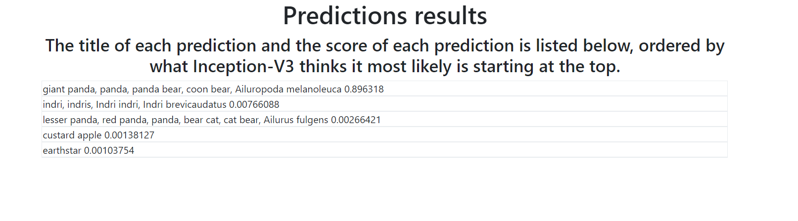
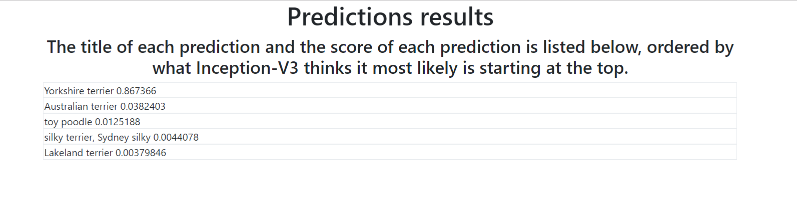

# Emerging technologies Project

- Name: Conor Tighe
- GMIT ID: G00314417
- Application: Image-Identifier
- Lecturer: Ian McLoughlin

This is the solution for the Emerging technology [project](https://emerging-technologies.github.io/problems/project.html), It can recognize digits + 1000 other classes using only TensorFlow.

# Overview:
*This application accepts an image from the user, displays it to the user then attempts to predict what the image is once submitted to a Inception-v3 model. You can upload a digit or draw your own digit inside the application and the retrained Inception-v3 model for digits will predict what digit was in the image based on the MNIST dataset . You can also upload any image to a separate model that will try classify the image into 5 of 1000 possible classes used for Inception-v3 with tensorflow.*

## Architecture

- Flask: *Flask is a micro web framework written in Python and based on the Werkzeug toolkit and Jinja2 template engine. This is what I used to host the application and server the html pages to the user*

- FabricJs: *Fabric.js is a powerful and simple. Javascript HTML5 canvas library. Fabric provides interactive object model on top of canvas element. I use this to implement a canvas the user can draw digits on along with being easily saved locally.*

- Tensorflow: *TensorFlow is an open-source software library for dataflow programming across a range of tasks. This is what I use to implement the Inception-v3 model for predicting the images. Once model is retrained for digit images and another is trained for 1000 classes.*

- AJAX: *AJAX allows web pages to be updated asynchronously by exchanging data with a web server behind the scenes. This means that it is possible to update parts of a web page, without reloading the whole page. This is what
I use to implement the posts of the image to tensorflow and then display them in a bootstrap table.*

- Bootstrap: *Bootstrap is an open source toolkit for developing with HTML, CSS, and JS. This is what I use to create the AI and display the tensor results.*

### How these interact:
Flask opens the index.html file on load to show the webpage to the user, user can then draw an image and convert it to .png. If the user saves the png locally they can then go to the Image recognizer section and select it from he directory they saved it to and then the image will be displayed. The user can click the submit button and a AJAX call will be made to the appropriate flask url which will call the tensorflow methods and pass the image filename to them. tensoflow will retrieve the image and then being to use the tensorflow Inception-v3 model to predict the image. Once the predictions are made the results are returned as a list of what the image most likely is starting with the higher score, these are then displayed to the user.

---

## Requirements
- Python 3.6: https://www.python.org/downloads/

## Setup
To run the application you must use the cmd to navigate to the directory you wish to store the app and then entry the following into the cmd:
```
git clone https://github.com/ConorTighe1995/Image-Identifier.git

```
Once the download is complete to start the app enter the following code in the cmd:
```
python app.py

```
---

## Deep Neural Network Implementation
This application uses a Deep Neural Network called Inception-v3 to predict images. The reason I decided to choose this DNN Model is because its the most accurate model offered by tensorflow for image recognition.
I first set up the application with the regular model that offers 1000 classes, I then retrained the model Inception-v3 to recognize a class of digits using the 60,000 images offered by the [MNIST dataset](http://yann.lecun.com/exdb/mnist/).

### What is a Neural Network?
Neural networks are a set of algorithms, modeled loosely after the human brain, that are designed to recognize patterns. They interpret sensory data through a kind of machine perception, labeling or clustering raw input. The patterns they recognize are numerical, contained in vectors, into which all real-world data, be it images, sound, text or time series, must be translated. In this project we give a neural network the MNIST dataset as input in order to for it to perform deep learning on the images.

### Non-deep Vs Deep neural networks:


### Retraining Inception-v3 for digits

#### Step 1:
You can use any set of images to teach Inception-v3 to predict a specific class, for this I will use MNIST as it offers a good variety of hand drawn images in order to make our prediction of the hand drawn canvas digit as
Accurate as possible. First run the MNIST python file provided in the repository with he code below to covert the train-images to .png. These are .pngs by default so you will have to use a software to convert then to .jpg for tensorflow. I used the following program to convert them in bulk: https://sourceforge.net/projects/bulkimageconver/ but you can use any method for this step.

```
python MNIST.py

```

#### Step 2:
Sort the images into labed folders for showing tensorflow the differences between each digit:

```
~/DigitPhotos
 
~/DigitPhotos/0/img1.jpg
 
~/DigitPhotos/0/img2.jpg
 
...
 
~/DigitPhotos/9/img1.jpg
 
~/DigitPhotos/9/img2.jpg
 
~/DigitPhotos/9/img3.jpg
 
...

```
#### Step 3:
Clone the image retraining repository provided by [akshaypai](https://github.com/akshaypai/tfClassifier/tree/master/image_classification), the reason I didn't use the official tensorflow retrain.py as it was throwing errors with the MNIST dataset files so I discovered this updated retrain.py file for the classifier. Use the following code to create the bottlenecks in out graph file the model will use to predict the image:
 


This will create an new .pb file named output.pb, this will overwrite the output.pb that I have provided in the repo, the model in the repo in trained at 6000 steps. 4000 is the default and is the recommended amount for a typical DNN model to get a accurate result, but you can incrase the accuracy of the model by increasing the training steps. The more steps you set it to the longer it will take to retrain the model.

#### Step 4:
Start using the app to test your model new model, you can replace the digits Model with any set of images you wish and rename the folders appropriately, Inception-v3 could be retrained you identify any class of images you like cars,clothes etc..

---

## User Controls
Switch between draw and png mode with the buttons above. Your digit can be dragged around in png mode and then switched back to draw mode to continue editing. Choose an image and then click submit to start tensorflow.

Draw an image:


Upload digit:


Predictions:


Try the test image from tensorflow.org:


Predictions for panda:


Try my dog:


Predictions for my dog:


---

## Application accuracy:

The first model for digits I created used 4000 for recognition and managed to achieve a accuracy of 92%, the expected accuracy for a trained tensorflow Inception-v3 model is 90-95% according to the tensorflow site. After using the canvas to draw digits tensorflow was still mixing up 0 and 8 along with 2 and 5, So to make the application better at distinguishing between the numbers by adding images drawn by the fabricJs canvas to the MNIST dataset, the reason I did this is because I thought the images Inception v3 where being trained by where very low quality and blurry compared to the ones being given to it for recognition from the canvas and training input has a major impact on the quality of DNN results. After expanding the input I retrained the model at 6000 steps, that resulted in a accuracy of 94%. It took my computer afew hours to train the digit model but with enough steps and computing resources the accuracy of this model could be improved even more, possibly to the point where it would be on par with the Inception-v3 model for normal images that has a error rate of only 3.46%.


## References

-[TensorFlow](https://www.tensorflow.org/tutorials/image_recognition)

-[how to retrain Tensorflow Inception model to add new classes on Ubuntu](https://sourcedexter.com/retrain-tensorflow-inception-model/)

-[FabricJS site](http://fabricjs.com/docs/)